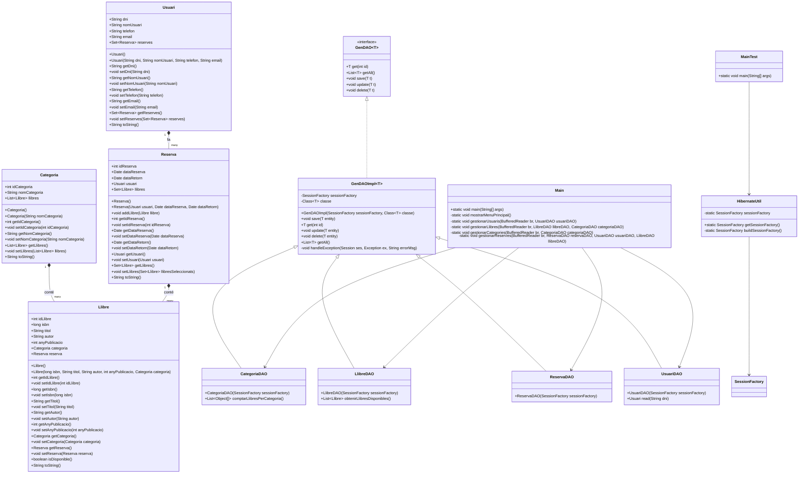

# Reflexió i Sintesi

## 1. De quina lògica d’aplicació s’encarrega el Patró DAO?

El **DAO** (Data Access Object) s'encarrega de separar la lógica de negoci de la lógica de per accedir a les dades, en una aplicació.

Això significa que el DAO **gestiona tota la interacció amb la base de dades, incloent la persistència de les entitats** (crear, llegir, actualitzar i eliminar) mitjançant l'ús de sentències SQL o HQL.

Aquest patró permet tenir una capa d'abstracció que facilita la modificació de la lògica de persistència sense afectar la resta de l'aplicació.

## 2. Per què considereu què és útil el patró DAO i en què us ha servit?

El patró DAO és útil perquè proporciona una manera neta i estructurada de gestionar la persistència de dades.

- Ens ajuda a mantenir el codi organitzat, separant la lògica d'accés a dades de la resta de l'aplicació, el que fa que sigui més fàcil de mantenir i escalar.
- Permet una major reutilització del codi, ja que es poden crear mètodes comuns de gestió de dades en un lloc i utilitzar-los a tota l'aplicació. En el nostre cas, ens ha servit per implementar de manera modular i robusta l'accés a la base de dades, facilitant la gestió de les entitats com `Usuari`, `Llibre`, `Categoria` i `Reserva`.
- En cas de canviar de base de dades (per exemple de SQL a alguna NoSQL) el canvi en el codi es mínim.

## 3. Heu hagut de fer cap ajust al vostre codi d’aplicació (Main, Controladors, Vistes, altres classes que no siguin DAO, etc.) ? Si és així, detalleu de forma breu quins canvis heu fet i per què?

Sí, però els canvis han sigut mínims. Més enllà de la nova implementació del DAO, canviar els mètodes dels dao (i mantenir algún mètode específic), l'únic canvi ha sigut en el `main`, per el canvi de noms en els mètodes a cridar.
La resta ha quedat tot igual, i el funcionament de l'aplicació funciona exactament igual.

## 4. D’igual forma que s’ha fet a l’enunciat, completeu el diagrama de classes de l’activitat A01 de la UF2 incorporant les interfícies, la classe abstracta i els DAOs. Per acoblar això, cal que relacioneu cada classe del model amb el seu DAO (sols aquelles classes que heu treballat a l’A03, no totes!!!)

Explicació del diagrama:
Categoria: Representa una categoria de llibres. Té una relació "one-to-many" amb Llibre, ja que una categoria pot contenir múltiples llibres.

Llibre: Representa un llibre. Té una relació "many-to-one" amb Categoria i una relació "many-to-one" amb Reserva.

Reserva: Representa una reserva de llibres. Té una relació "many-to-one" amb Usuari i una relació "one-to-many" amb Llibre.

Usuari: Representa un usuari de la biblioteca. Té una relació "one-to-many" amb Reserva, ja que un usuari pot fer múltiples reserves.

GenDAO: És una interfície que defineix les operacions bàsiques de CRUD.

GenDAOImpl: És una implementació genèrica de GenDAO que gestiona les operacions de base de dades.

CategoriaDAO, LlibreDAO, ReservaDAO, UsuariDAO: Són classes que estenen GenDAOImpl per gestionar les operacions específiques de cada entitat.

HibernateUtil: És una classe utilitària per gestionar la sessió de Hibernate.

Main: És la classe principal que conté el menú i la lògica de l'aplicació.

MainTest: És una classe de prova per comprovar la connexió a Hibernate.

## 5. Per últim valoreu el paper que hi juga la classe abstracta. És en tots els casos necessària? En el cas de l’activitat A02 de la UF2, on vau emprar JDBC, penseu que seria d’utilitat?

La classe abstracta `GenDaoImpl` és útil perquè centralitza la lògica comú per a totes les entitats (CRUD, gestió d'errors, etc.). Això permet evitar duplicació de codi en les classes que implementen el DAO per cada entitat.

En el cas de l’activitat A02, on es va emprar JDBC, considero que aquesta classe abstracta podria ser útil, per tenir tot el codi conjunt en una classe evitant duplicitats. Però també cal tenir en compte que els DAO realitzats no eren massa complicats, i si són així de simples, i no tenim cap intenció de continuar desenvolupant la app i incorporant novetats, potser per temps no ens és imprescindible crear-la.
